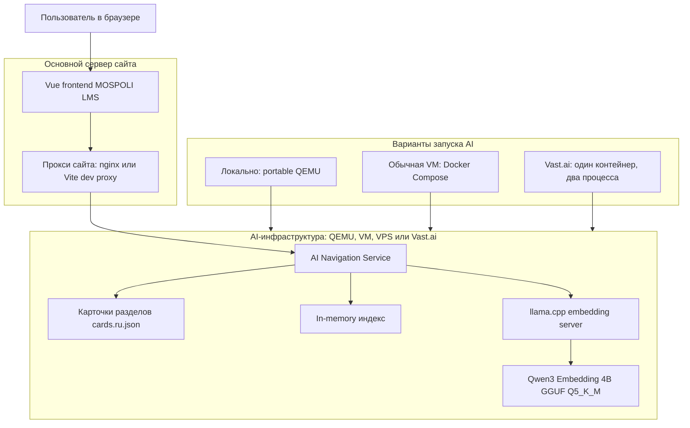
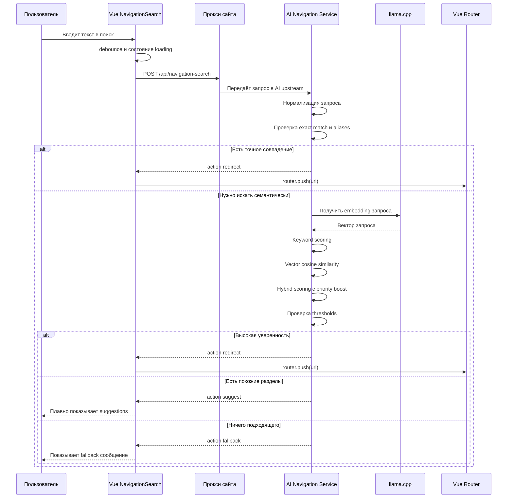
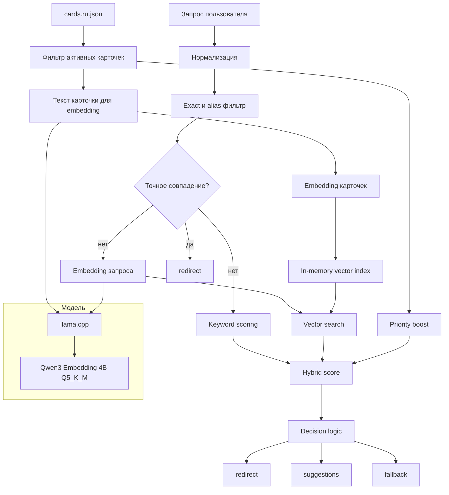

# AI-навигация MOSPOLI LMS: инфраструктура и алгоритм

Этот файл показывает всю текущую схему крупными блоками: где живёт сайт, где живёт AI-инфраструктура, как проходит поисковый запрос и какие фильтры участвуют в принятии решения.

## 1. Общая инфраструктура



Главная идея: основной сайт и AI могут жить на разных серверах. Браузер обращается только к своему сайту по `/api/navigation-search`, а сервер сайта проксирует запрос на AI-сервис через переменную `AI_NAVIGATION_UPSTREAM`.

## 2. Как проходит запрос от пользователя до результата



Frontend не знает про `llama.cpp`, модель, Docker, QEMU или Vast.ai. Для него существует только один API endpoint.

## 3. Алгоритм поиска, модели и фильтры



В поиске участвуют только подготовленные карточки разделов LMS. Сырой HTML, Vue-компоненты, пароли, токены и личные данные в embedding-модель не отправляются.

Основные фильтры и оценки такие:

```text
Exact match: id, url, title, aliases
Keyword score: title, breadcrumbs, description, aliases, keywords
Vector score: cosine similarity между embedding запроса и embedding карточки
Priority boost: небольшой бонус важным разделам
```

Формула MVP:

```text
final_score = vector_score * 0.7 + keyword_score * 0.3 + priority_boost
```

Пороги MVP:

```text
redirect: top1_score >= 0.82 и gap >= 0.08
suggest:  top1_score >= 0.62
fallback: если score ниже suggest-порога
```

Сейчас в MVP нет чат-бота, генерации ответов и reranker. Используется только embedding-модель для семантической навигации по разделам LMS.
