# AI-навигация MOSPOLI LMS: инфраструктура и алгоритм

Документ коротко показывает, как сайт общается с AI-сервисом, где живёт модель, какие фильтры участвуют в поиске и как принимается решение: перейти сразу, показать подсказки или вернуть fallback.

## 1. Общая production-схема

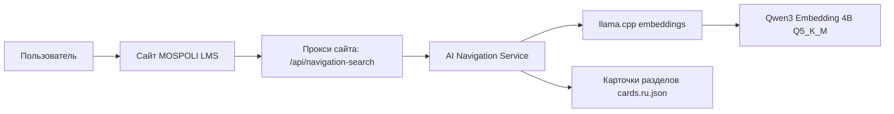

Главная идея простая: браузер не знает, где находится AI-сервер. Он отправляет запрос на свой же домен по адресу `/api/navigation-search`, а сервер сайта проксирует этот запрос на AI-инфраструктуру.

## 2. Локальная схема через portable QEMU

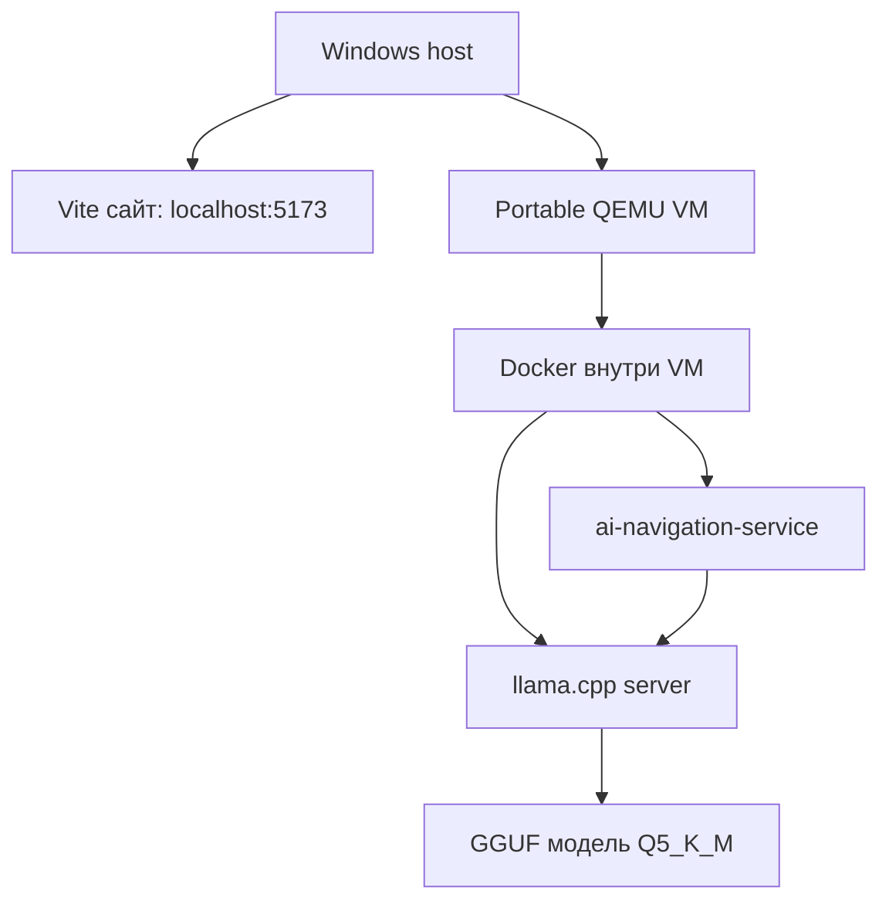

Такой вариант нужен для локального запуска без Docker Desktop. QEMU лежит в папке проекта, Docker установлен внутри Linux VM, а модель хранится в `models/`.

## 3. Схема для Vast.ai

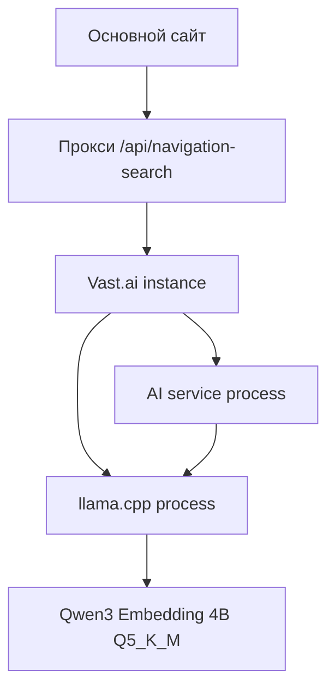

Для Vast.ai лучше использовать один контейнер Vast, внутри которого запускаются два процесса: `llama.cpp` и `ai-navigation-service`. Так проще, чем Docker-in-Docker.

## 4. Схема для обычной VM или VPS

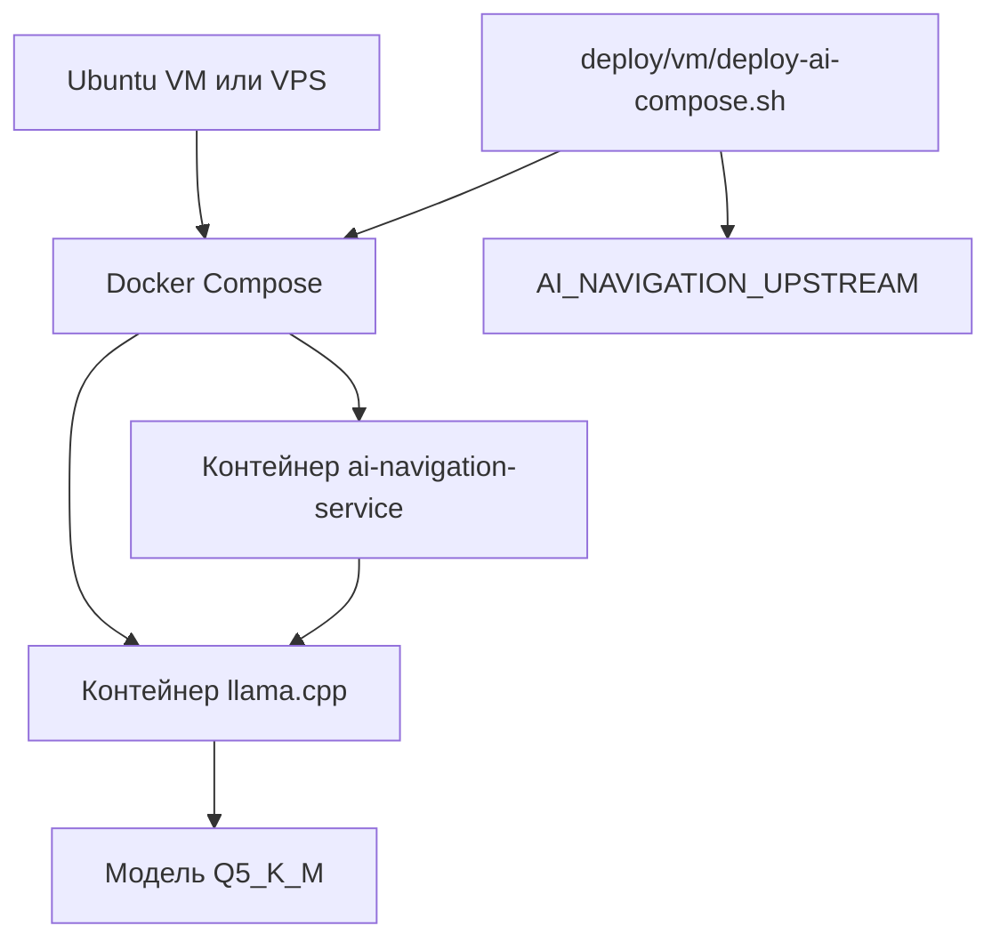

На обычной VM используется привычный вариант с двумя Docker-контейнерами. Скрипт деплоя поднимает compose и выводит переменную `AI_NAVIGATION_UPSTREAM`, которую нужно указать в nginx/proxy основного сайта.

## 5. Как проходит запрос пользователя

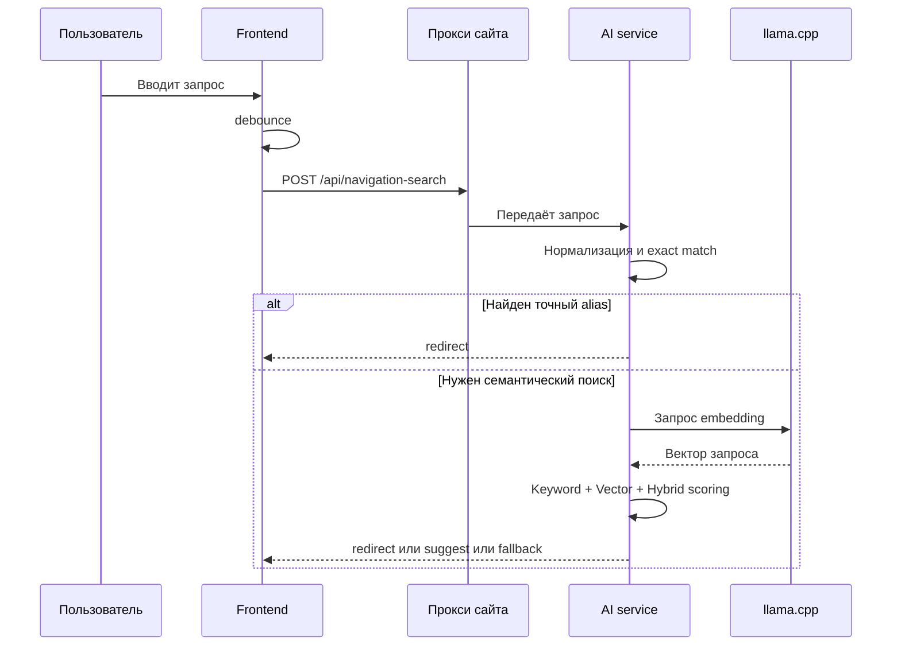

Frontend не вызывает `llama.cpp` напрямую. Вся AI-логика скрыта за одним API.

## 6. Алгоритм поиска

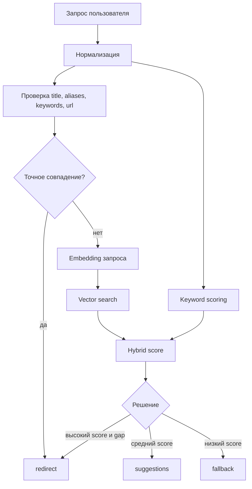

Сначала всегда проверяются простые точные совпадения. Это быстрее и надёжнее для запросов вроде `войти`, `регистрация`, `оценки`. Если точного совпадения нет, используется embedding-поиск.

## 7. Какие данные участвуют в поиске

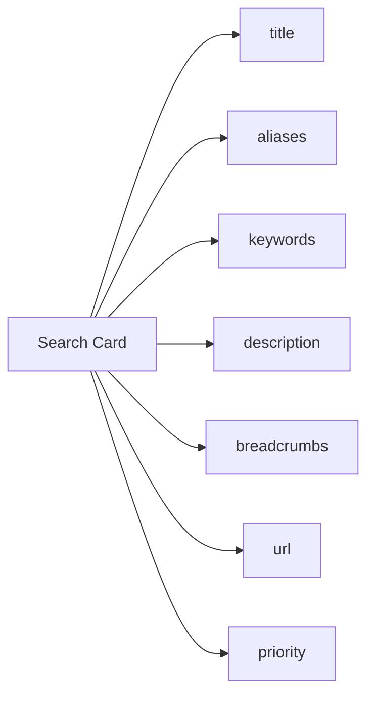

В модель не отправляются Vue-компоненты, HTML, пароли, токены или личные данные. В embedding уходит только заранее подготовленное описание раздела из `cards.ru.json`.

## 8. Как строится индекс

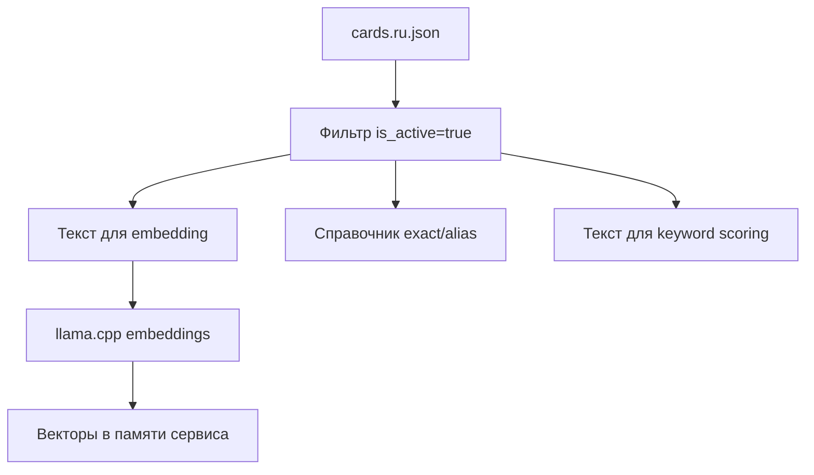

Сейчас индекс хранится в памяти сервиса. Для MVP этого достаточно, потому что карточек разделов мало. Позже это можно заменить на Qdrant, FAISS, pgvector или SQLite без изменения frontend API.

## 9. Модель и компоненты

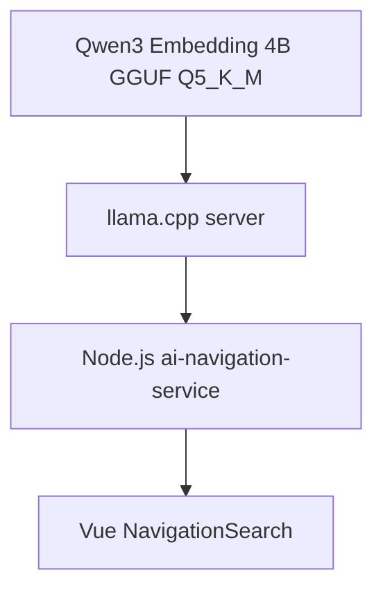

В MVP нет чат-бота, генерации ответов и reranker. Используется только embedding-модель для поиска подходящего раздела LMS.

## 10. Фильтры и scoring

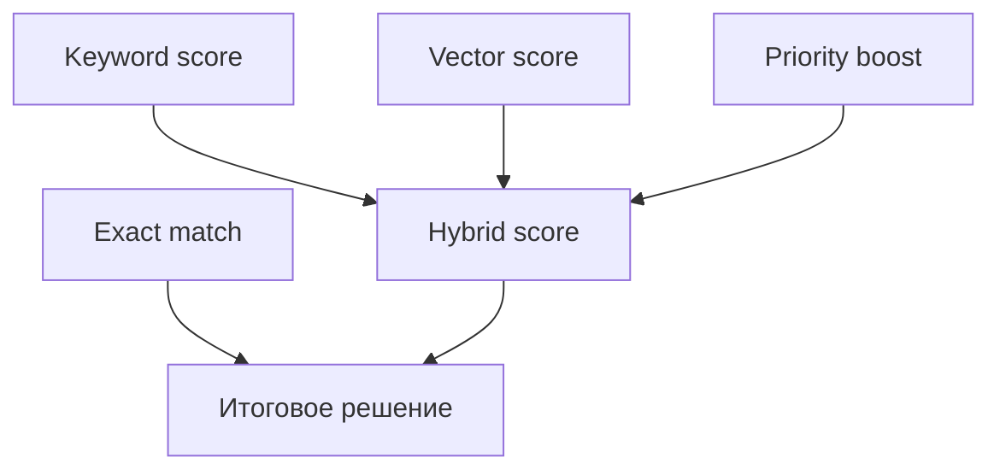

Основные фильтры и оценки такие:

```text
Exact match: id, url, title, aliases
Keyword score: title, breadcrumbs, description, aliases, keywords
Vector score: cosine similarity по embeddings
Priority boost: небольшой бонус важным разделам
```

Формула:

```text
final_score = vector_score * 0.7 + keyword_score * 0.3 + priority_boost
```

Пороговые значения:

```text
redirect: score >= 0.82 и gap >= 0.08
suggest:  score >= 0.62
fallback: всё ниже suggest-порога
```

## 11. Поведение в интерфейсе

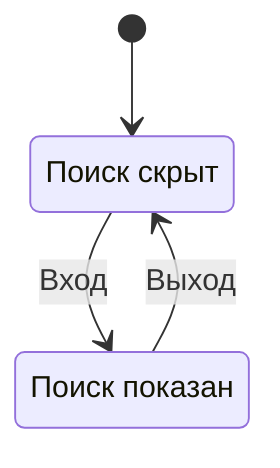

Сейчас авторизация временная и хранится во frontend через `localStorage`. До входа строка поиска скрыта. После входа она появляется.

## 12. Как сайт узнаёт адрес AI

```mermaid
flowchart LR
    deploy[Деплой AI] --> upstream[AI_NAVIGATION_UPSTREAM]
    upstream --> nginx[Nginx сайта]
    browser[Браузер] --> sameorigin[/api/navigation-search]
    sameorigin --> nginx
    nginx --> ai[AI service]
```

При деплое AI-инфраструктуры получается адрес вида:

```env
AI_NAVIGATION_UPSTREAM=http://AI_HOST:3001
```

Этот адрес нужен серверу сайта или nginx. В браузер его лучше не отдавать. Frontend продолжает ходить на относительный путь `/api/navigation-search`.
