# MOSPOLI LMS AI Navigation: Infrastructure and Search Algorithm

This document describes the current AI navigation-search infrastructure, deployment variants, involved models, filters, scoring stages, and frontend integration.

## 1. High-level production architecture

```mermaid
flowchart LR
    U[User in Browser] --> F[MOSPOLI LMS Frontend]
    F -->|same-origin fetch('/api/navigation-search')| N[LMS Web Server / Nginx]
    N -->|proxy_pass| A[AI Navigation Service :3001]
    A -->|HTTP embeddings request| L[llama.cpp Embedding Server :8080]
    L --> M[(Qwen3-Embedding-4B GGUF Q5_K_M)]

    subgraph LMS_Server[Main LMS server]
        F
        N
    end

    subgraph AI_Runtime[AI infrastructure: VM / Vast.ai / QEMU]
        A
        L
        M
    end

    A --> C[(cards.ru.json)]
    A --> I[(in-memory vector index)]
```

The browser does not know where the AI infrastructure is deployed. It calls only the LMS domain. The LMS server proxies `/api/navigation-search` to the AI upstream.

## 2. Local portable QEMU architecture

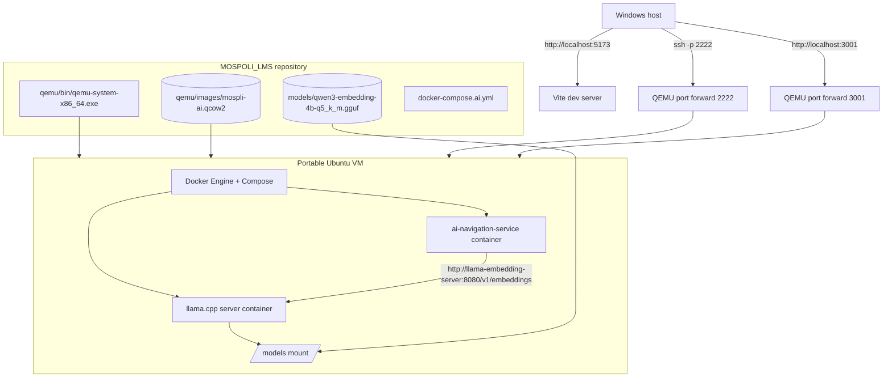

Local QEMU is useful for development and demonstrations without Docker Desktop on Windows. Docker runs inside the VM.

## 3. Vast.ai deployment architecture

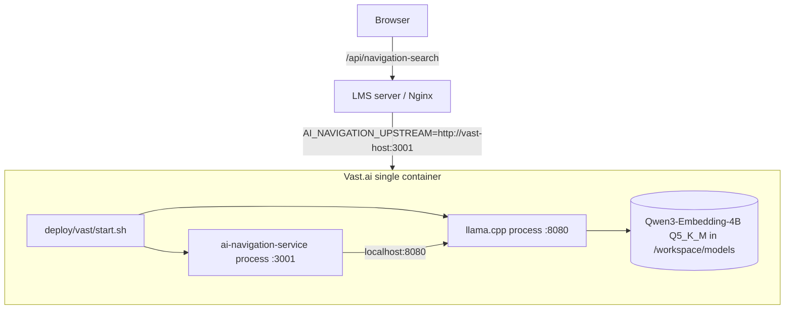

Vast.ai instances are already containerized, so the recommended Vast mode is one image with two processes instead of Docker-in-Docker.

## 4. Normal VM deployment architecture

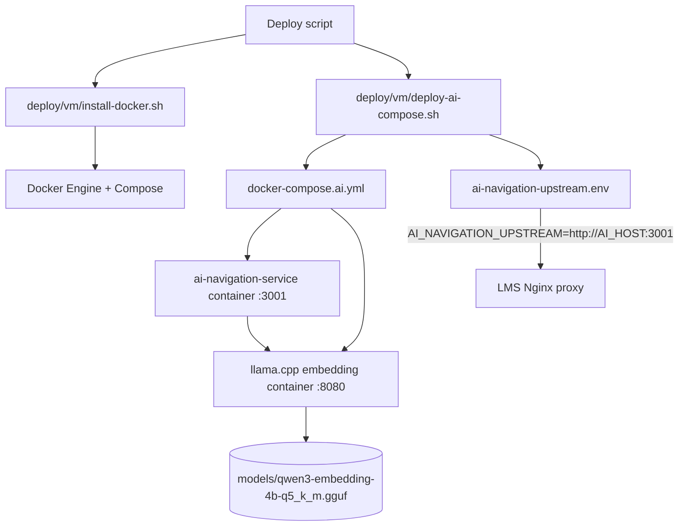

This is the recommended mode for an ordinary VPS or private VM where Docker can run normally.

## 5. Frontend request flow

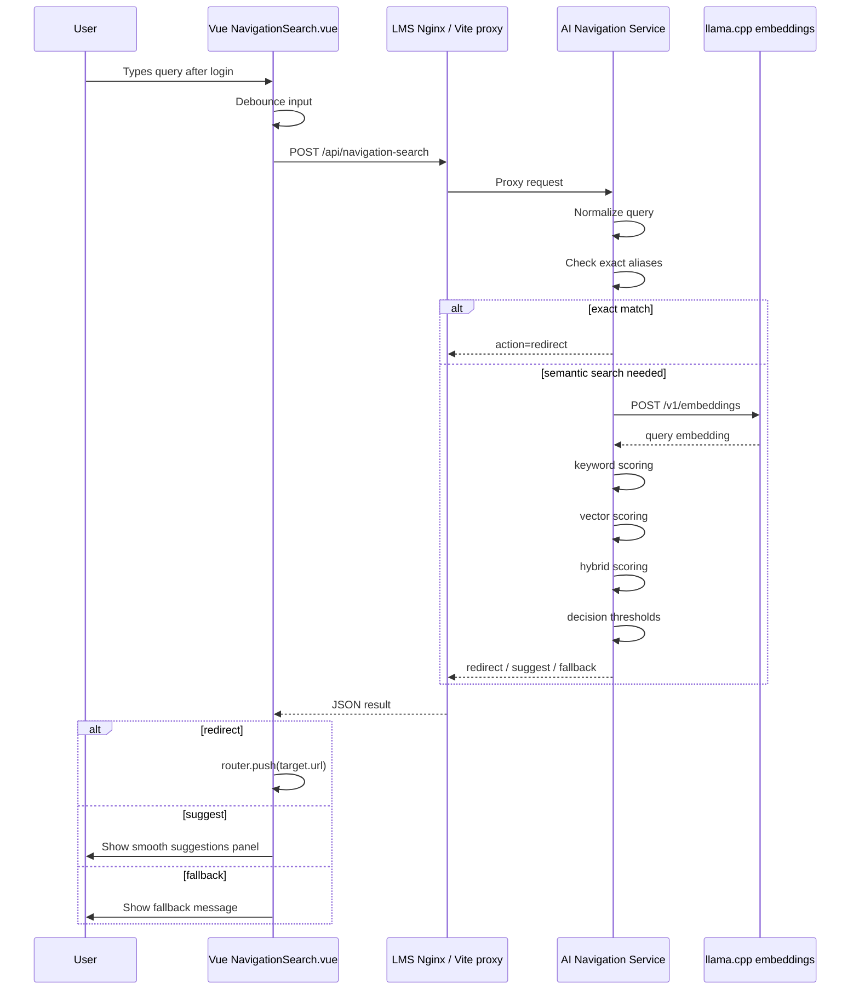

## 6. Search pipeline and filters

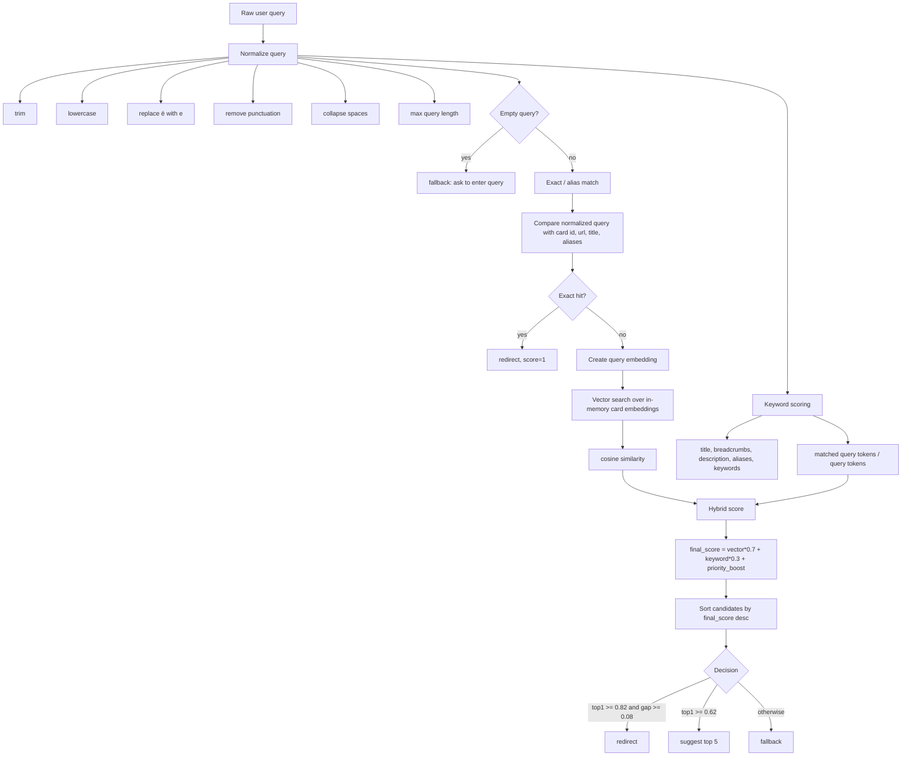

## 7. Index build flow

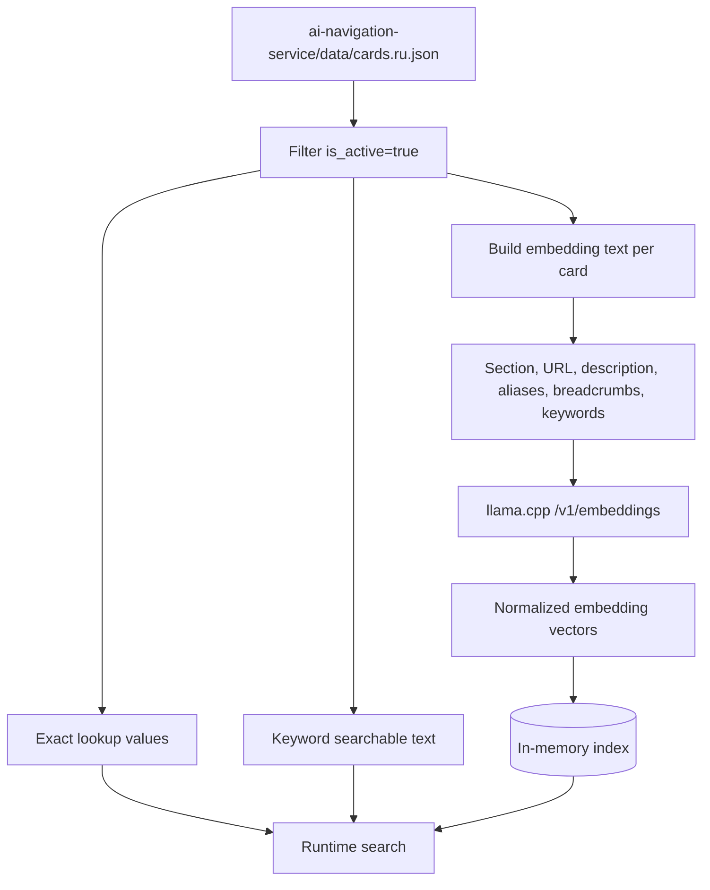

The service does not embed Vue components, HTML, passwords, tokens, or private user data. Only curated search cards are embedded.

## 8. Data model for a search card

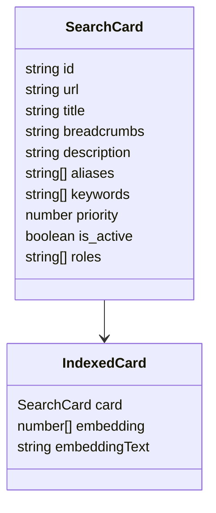

Current initial cards are login, register, dashboard, courses, assignments, grades, profile, and help.

## 9. Models and runtime components

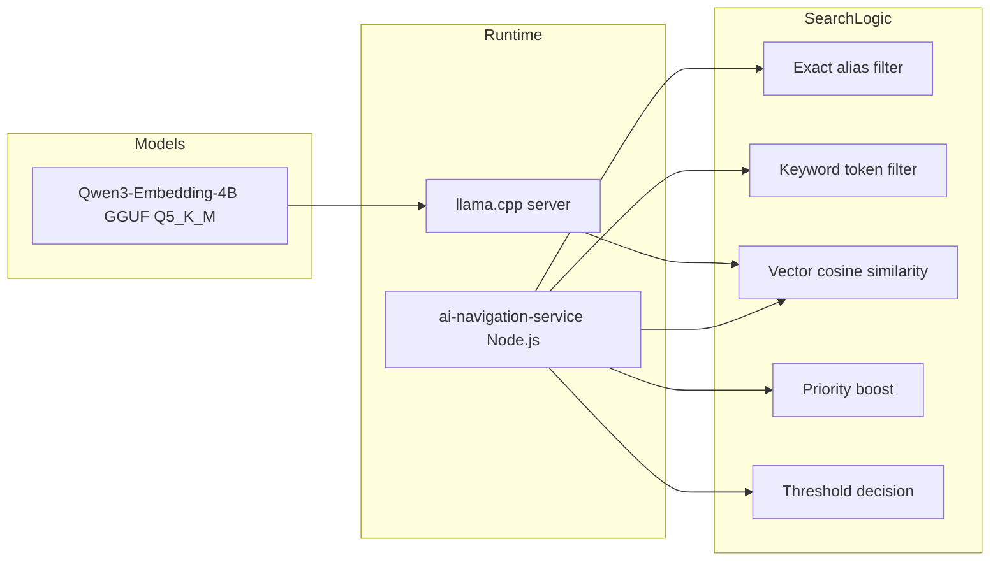

There is no reranker in the MVP. There is no generative chat model. The embedding model is used only for semantic navigation search.

## 10. Scoring and thresholds

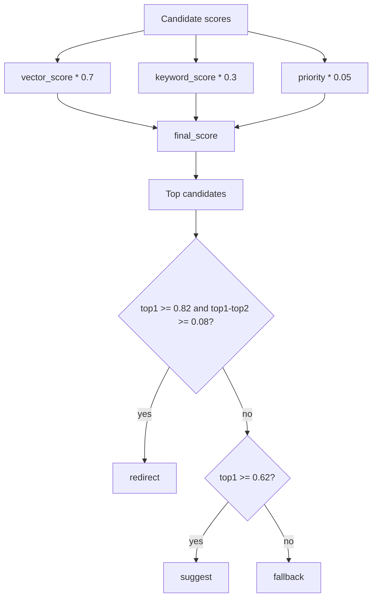

Default values are configurable through environment variables:

```env
VECTOR_WEIGHT=0.7
KEYWORD_WEIGHT=0.3
PRIORITY_WEIGHT=0.05
T_REDIRECT=0.82
T_GAP=0.08
T_SUGGEST=0.62
SUGGESTIONS_COUNT=5
```

## 11. Auth-related UI behavior

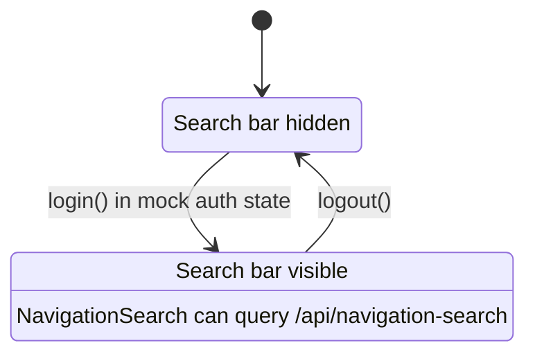

Current authentication is only a frontend mock using `localStorage`. Real auth/backend integration is not implemented yet.

## 12. Deployment output and proxy variable

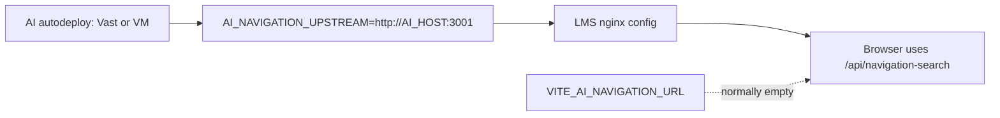

The preferred production setup keeps `VITE_AI_NAVIGATION_URL` empty and uses same-origin proxying. This avoids CORS and lets the AI host change without rebuilding the frontend.
